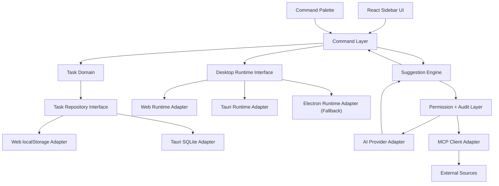

# Architecture Diagram

## Important Boundary

The React UI does not import Tauri, Electron, MCP servers, or AI SDKs directly.
Everything goes through command, runtime, repository, and permission layers.

